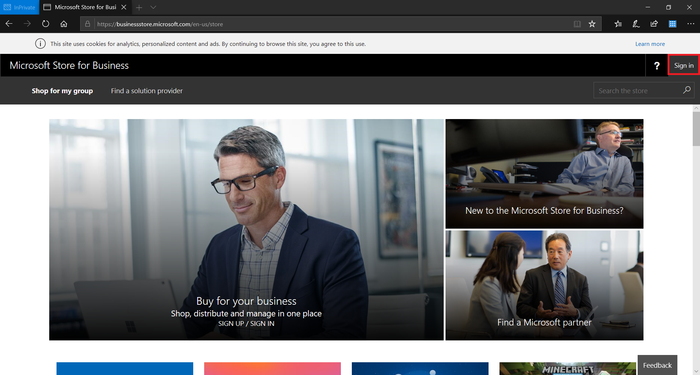
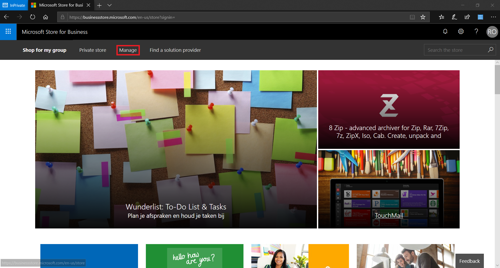
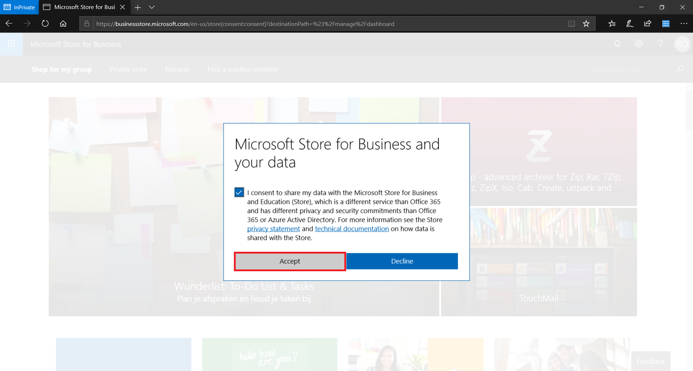

# Introduction

This document describes the process to deploy a DWP environment from scratch, using newly created subscriptions. 

# Configure Tenant

## Office 365

### Add Domains

### DNS

## Enterprise Mobility + Security

## Microsoft Store for Business

### Sign up for Microsoft Store for Business

1. Go to https://businessstore.microsoft.com

2. Click Sign in

   
   
   
3. Log in with the Global Administrator of the customer tenant. Note that the account that first logs in to the store will remain the owner of the store. This cannot be changed later on.

4. Click Manage

   

5. Click Accept

   

### Associate your Microsoft Store for Business account with Intune

